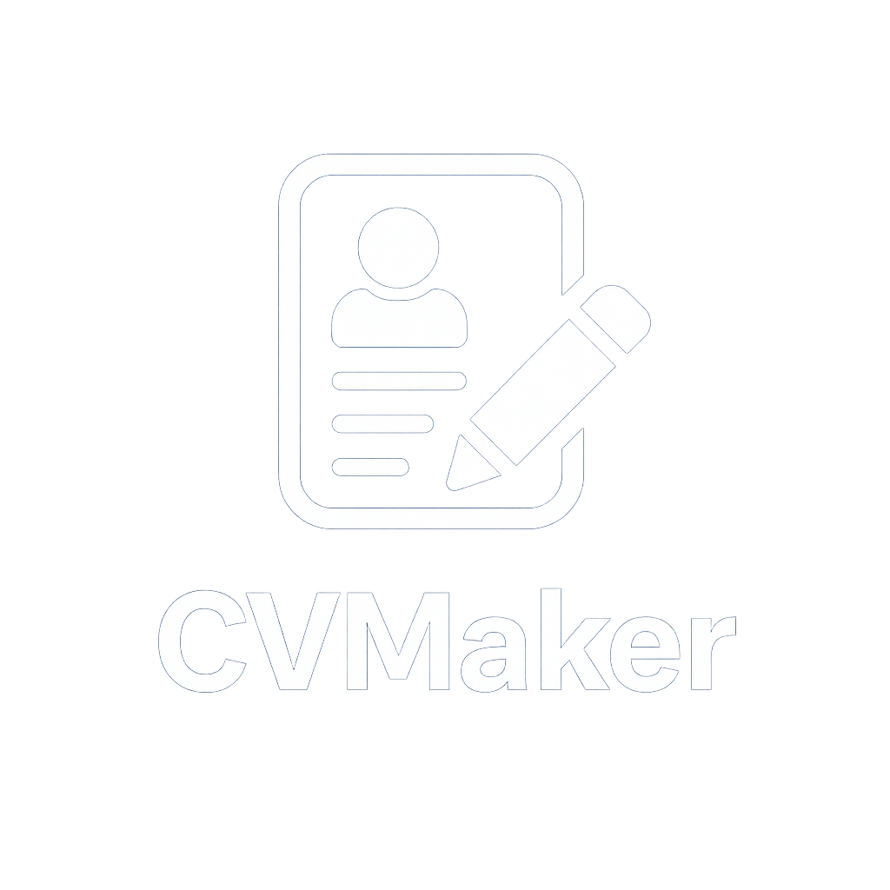

# StyleCV - Professional Resume Builder

 <!-- Using your actual banner asset -->

StyleCV is a cutting-edge Flutter application that transforms resume building into a seamless, visually stunning experience with professional templates and intuitive design.

## ✨ Key Features

- **Modern UI/UX**  
  Elegant interface with your brand colors (#142831 primary, #1a936f accent)
  
- **Dynamic Sections**  
  Easily add/remove work experiences, education, and skills

- **Cloud Sync**  
  Firebase-backed data storage for access across devices

- **Unique Animations**  
  Custom portal-style transitions between screens

- **PDF Export**  
  Generate and share professional PDF resumes

## 📱 Screenshots

<div align="center">
  
  
  
</div>

## 🛠 Technical Architecture

```mermaid
graph TD
    A[Flutter UI] --> B[Firebase Auth]
    A --> C[Firestore Database]
    A --> D[Storage]
    B --> E[User Management]
    C --> F[CV Data]
    D --> G[Profile Images]
